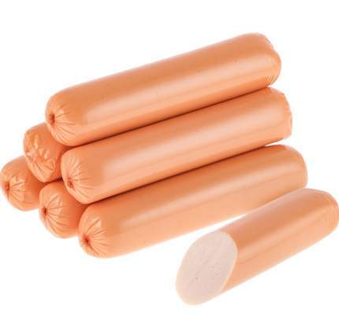

# заголовок 1
## заголовок 2
### заголовок 3
#### заголовок 4
##### заголовок 5
###### заголовок 6

*курсив* / _курсив_

**жирный** / _жирный_

***жирный и курсив*** / _жирный и курсив_

~~зачеркнутый~~ 

Списки

- пункт 1
- пункт 2
  - Вложенный
  - еще
  - *пункт 3
  + пункт 4
 
  1. Первый
  2. Второй
  3. Третий
     1. Вложенный
     2.  Еще
    
   -[x] 1
   -[ ] 2
   - [ ] 3
   [текст ссылки](https:/example.com)
   [ с подсказкой](https://example.com "При наведении")
   <https://auto-link.com>
[ссылочный стиль] [1]
[1] :https://example.com

100074947938b0.jpg

Картинки 
--------

 

